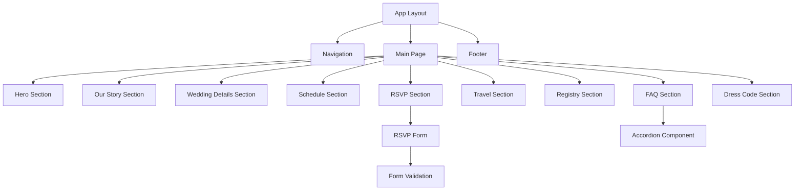
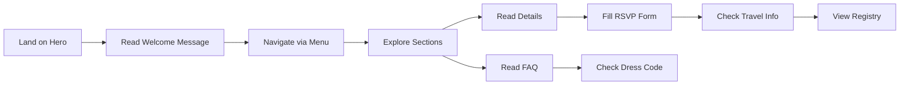
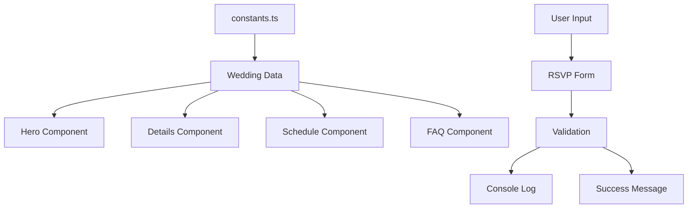
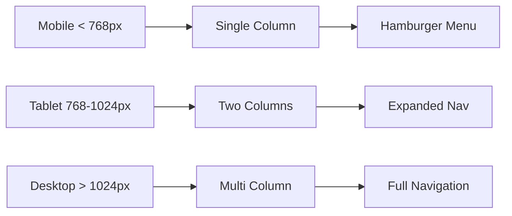

# Wedding Website Architecture Plan

## Project Overview

A modern, single-page wedding information hub built with Next.js 14+, TypeScript, and Tailwind CSS. The website will serve as a comprehensive resource for wedding guests to find all necessary information about the ceremony, reception, travel, and more.

**Project Location:** `D:\Projects\wedding-website`

---

## Technology Stack

### Core Technologies
- **Framework:** Next.js 14+ (App Router)
- **Language:** TypeScript
- **Styling:** Tailwind CSS
- **Animations:** Framer Motion (for smooth transitions and scroll animations)
- **Form Validation:** React Hook Form + Zod
- **Icons:** Lucide React or Heroicons

### Development Tools
- **Package Manager:** npm or pnpm
- **Linting:** ESLint
- **Formatting:** Prettier
- **Version Control:** Git

---

## Project Structure

```
wedding-website/
├── src/
│   ├── app/
│   │   ├── layout.tsx           # Root layout with metadata
│   │   ├── page.tsx              # Main page with all sections
│   │   ├── globals.css           # Global styles and Tailwind imports
│   │   └── favicon.ico
│   ├── components/
│   │   ├── layout/
│   │   │   ├── Navigation.tsx    # Sticky navigation with smooth scroll
│   │   │   └── Footer.tsx        # Footer with contact info
│   │   ├── sections/
│   │   │   ├── Hero.tsx          # Welcome section
│   │   │   ├── OurStory.tsx      # Couple's story
│   │   │   ├── WeddingDetails.tsx # Ceremony & reception info
│   │   │   ├── Schedule.tsx      # Timeline of events
│   │   │   ├── RSVP.tsx          # RSVP form (UI only)
│   │   │   ├── Travel.tsx        # Accommodations & travel info
│   │   │   ├── Registry.tsx      # Gift registry links
│   │   │   ├── FAQ.tsx           # Frequently asked questions
│   │   │   └── DressCode.tsx     # Attire guidelines
│   │   └── ui/
│   │       ├── Button.tsx        # Reusable button component
│   │       ├── Card.tsx          # Card component
│   │       ├── Accordion.tsx     # Accordion for FAQ
│   │       └── Input.tsx         # Form input component
│   ├── lib/
│   │   ├── utils.ts              # Utility functions
│   │   └── constants.ts          # Wedding data constants
│   └── types/
│       └── index.ts              # TypeScript type definitions
├── public/
│   ├── images/
│   │   ├── hero.jpg              # Hero/engagement photo
│   │   ├── couple/               # Photos for story section
│   │   └── venue/                # Venue photos
│   └── fonts/                    # Custom fonts (optional)
├── tailwind.config.ts
├── tsconfig.json
├── next.config.js
├── package.json
└── README.md
```

---

## Section Architecture

### 1. Hero/Welcome Section
**Purpose:** First impression with couple names, date, and location

**Features:**
- Full-viewport hero image with overlay
- Couple names in elegant typography
- Wedding date with countdown timer (optional)
- Location with icon
- Scroll indicator to next section
- Parallax effect on scroll (optional)

**Data Structure:**
```typescript
interface HeroData {
  bride: string;
  groom: string;
  date: Date;
  venue: string;
  location: string;
  welcomeMessage: string;
  heroImage: string;
}
```

---

### 2. Our Story Section
**Purpose:** Share the couple's journey

**Features:**
- Timeline layout or narrative cards
- Photos from relationship milestones
- How you met, first date, proposal story
- Animated entrance on scroll
- Optional: Interactive timeline

**Data Structure:**
```typescript
interface StoryMilestone {
  id: string;
  title: string;
  date: string;
  description: string;
  image?: string;
}
```

---

### 3. Wedding Details Section
**Purpose:** Core ceremony and reception information

**Features:**
- Two-column layout (ceremony | reception)
- Date, time, and venue for each
- Embedded Google Maps or map links
- Venue photos
- Directions button

**Data Structure:**
```typescript
interface EventDetails {
  type: 'ceremony' | 'reception';
  date: Date;
  time: string;
  venueName: string;
  address: string;
  mapUrl: string;
  description?: string;
}
```

---

### 4. Schedule/Timeline Section
**Purpose:** Day-of event timeline

**Features:**
- Visual timeline with icons
- Time slots for each event
- Color-coded events
- Responsive vertical timeline
- Smooth animations

**Data Structure:**
```typescript
interface ScheduleEvent {
  id: string;
  time: string;
  title: string;
  description: string;
  icon: string;
  duration?: string;
}
```

---

### 5. RSVP Section
**Purpose:** Guest response form (UI only, no backend)

**Features:**
- Multi-step form or single form
- Fields: Name, email, attendance, guest count, meal preference, song request
- Form validation with error messages
- Success message (simulated)
- Deadline date display
- Mobile-friendly inputs

**Data Structure:**
```typescript
interface RSVPFormData {
  fullName: string;
  email: string;
  attending: 'yes' | 'no' | 'maybe';
  guestCount: number;
  mealPreference?: string;
  dietaryRestrictions?: string;
  songRequest?: string;
  message?: string;
}
```

**Note:** Form will use `console.log` or local state for now. Backend integration can be added later.

---

### 6. Travel & Accommodations Section
**Purpose:** Help guests plan their trip

**Features:**
- Hotel blocks with booking links
- Airport information
- Transportation options (shuttle, parking, ride-share)
- Local attractions (optional)
- Cards layout for each hotel
- Map integration

**Data Structure:**
```typescript
interface Accommodation {
  id: string;
  name: string;
  address: string;
  phone: string;
  bookingUrl: string;
  bookingCode?: string;
  distance: string;
  amenities: string[];
}

interface TravelInfo {
  nearestAirport: string;
  airportCode: string;
  distanceFromVenue: string;
  parkingInfo: string;
  shuttleInfo?: string;
}
```

---

### 7. Registry/Gifts Section
**Purpose:** Share registry information

**Features:**
- Registry links with store logos
- Honeymoon fund option
- Charitable donation option
- "Your presence is enough" message option
- Beautiful card layout

**Data Structure:**
```typescript
interface RegistryLink {
  id: string;
  store: string;
  url: string;
  logo?: string;
}
```

---

### 8. FAQ Section
**Purpose:** Answer common guest questions

**Features:**
- Accordion component (expand/collapse)
- Categories: General, Attire, Travel, etc.
- Search functionality (optional)
- Smooth animations

**Data Structure:**
```typescript
interface FAQItem {
  id: string;
  question: string;
  answer: string;
  category: string;
}
```

**Common Questions:**
- What is the dress code?
- Are children welcome?
- Is the ceremony unplugged?
- What time should I arrive?
- Where can I park?
- Will there be food/drinks?
- Can I bring a plus-one?
- What if it rains?

---

### 9. Dress Code Section
**Purpose:** Guide guests on appropriate attire

**Features:**
- Visual examples with images
- Dress code name (Formal, Cocktail, Beach Casual, etc.)
- Do's and Don'ts
- Color palette suggestions
- Season/weather considerations

**Data Structure:**
```typescript
interface DressCode {
  type: string;
  description: string;
  examples: string[];
  dos: string[];
  donts: string[];
  colorPalette?: string[];
}
```

---

## Navigation Architecture

### Sticky Navigation Bar
**Features:**
- Fixed position on scroll
- Smooth scroll to sections
- Active section highlighting
- Mobile hamburger menu
- Transparent → solid background on scroll

**Navigation Items:**
1. Home
2. Our Story
3. Details
4. Schedule
5. RSVP
6. Travel
7. Registry
8. FAQ

---

## Design System

### Color Palette
**Recommendation:** Elegant and romantic

```css
/* Primary Colors */
--primary: #8B7355;        /* Warm taupe */
--primary-light: #A89080;
--primary-dark: #6B5645;

/* Accent Colors */
--accent: #D4AF37;         /* Gold */
--accent-light: #E8D4A0;

/* Neutrals */
--background: #FDFBF7;     /* Warm white */
--text-primary: #2C2C2C;
--text-secondary: #6B6B6B;
--border: #E5E5E5;

/* Semantic Colors */
--success: #4CAF50;
--error: #F44336;
--warning: #FF9800;
```

### Typography
**Recommendations:**
- **Headings:** Playfair Display, Cormorant, or Cinzel (serif, elegant)
- **Body:** Inter, Montserrat, or Lato (sans-serif, readable)
- **Accent:** Great Vibes or Dancing Script (script, for names)

### Spacing Scale
```
xs: 0.25rem (4px)
sm: 0.5rem (8px)
md: 1rem (16px)
lg: 1.5rem (24px)
xl: 2rem (32px)
2xl: 3rem (48px)
3xl: 4rem (64px)
```

### Breakpoints
```
sm: 640px
md: 768px
lg: 1024px
xl: 1280px
2xl: 1536px
```

---

## Animation Strategy

### Scroll Animations
- **Fade in:** Sections fade in as they enter viewport
- **Slide up:** Content slides up with fade
- **Stagger:** Child elements animate in sequence
- **Parallax:** Hero image moves slower than scroll

### Interaction Animations
- **Hover effects:** Buttons, cards, links
- **Click feedback:** Button press states
- **Form validation:** Error shake animation
- **Accordion:** Smooth expand/collapse

### Performance Considerations
- Use `will-change` sparingly
- Prefer `transform` and `opacity` for animations
- Use `IntersectionObserver` for scroll triggers
- Lazy load images below the fold

---

## Responsive Design Strategy

### Mobile First Approach
1. **Mobile (< 768px):**
   - Single column layout
   - Hamburger menu
   - Stacked cards
   - Touch-friendly buttons (min 44px)
   - Simplified timeline

2. **Tablet (768px - 1024px):**
   - Two-column layouts where appropriate
   - Expanded navigation
   - Larger images

3. **Desktop (> 1024px):**
   - Multi-column layouts
   - Full navigation bar
   - Larger hero section
   - Side-by-side content

---

## SEO & Performance Optimization

### Metadata
```typescript
export const metadata = {
  title: '[Couple Names] Wedding',
  description: 'Join us for our wedding celebration on [Date] at [Location]',
  openGraph: {
    title: '[Couple Names] Wedding',
    description: 'Join us for our wedding celebration',
    images: ['/images/og-image.jpg'],
    type: 'website',
  },
  twitter: {
    card: 'summary_large_image',
    title: '[Couple Names] Wedding',
    description: 'Join us for our wedding celebration',
    images: ['/images/og-image.jpg'],
  },
}
```

### Performance Optimizations
- **Image Optimization:** Use Next.js `<Image>` component
- **Lazy Loading:** Load images and components as needed
- **Code Splitting:** Automatic with Next.js App Router
- **Font Optimization:** Use `next/font` for Google Fonts
- **Minification:** Automatic in production build
- **Caching:** Leverage Next.js caching strategies

### Lighthouse Goals
- Performance: 90+
- Accessibility: 95+
- Best Practices: 95+
- SEO: 100

---

## Content Management Strategy

### Centralized Data
All wedding data stored in [`src/lib/constants.ts`](src/lib/constants.ts):

```typescript
export const WEDDING_DATA = {
  couple: {
    bride: 'Bride Name',
    groom: 'Groom Name',
  },
  date: new Date('2025-06-15'),
  ceremony: { /* ... */ },
  reception: { /* ... */ },
  schedule: [ /* ... */ ],
  faqs: [ /* ... */ ],
  // ... etc
}
```

**Benefits:**
- Single source of truth
- Easy to update
- Type-safe with TypeScript
- No CMS needed initially

### Future CMS Integration
If needed later, can integrate:
- Sanity.io
- Contentful
- Strapi
- Or simple JSON/Markdown files

---

## Form Handling (RSVP)

### Current Implementation (No Backend)
```typescript
const handleSubmit = (data: RSVPFormData) => {
  console.log('RSVP Submission:', data);
  // Show success message
  // Could store in localStorage for demo
}
```

### Future Backend Options
1. **Firebase/Firestore:** Real-time database
2. **Supabase:** PostgreSQL with real-time features
3. **Google Sheets API:** Simple spreadsheet storage
4. **Custom API:** Next.js API routes + database
5. **Form Services:** Formspree, Netlify Forms, etc.

---

## Deployment Strategy

### Recommended Platforms
1. **Vercel** (Recommended for Next.js)
   - Zero-config deployment
   - Automatic HTTPS
   - Global CDN
   - Free tier available

2. **Netlify**
   - Easy deployment
   - Form handling built-in
   - Free tier available

3. **GitHub Pages** (Static export)
   - Free hosting
   - Requires static export

### Custom Domain
- Purchase domain (e.g., `johnandjanewedding.com`)
- Configure DNS settings
- Add to hosting platform

---

## Development Workflow

### Phase 1: Setup & Foundation
1. Initialize Next.js project with TypeScript
2. Configure Tailwind CSS
3. Set up project structure
4. Install dependencies (Framer Motion, React Hook Form, etc.)
5. Create base layout and navigation

### Phase 2: Core Sections
1. Hero/Welcome section
2. Our Story section
3. Wedding Details section
4. Schedule/Timeline section

### Phase 3: Interactive Features
1. RSVP form with validation
2. FAQ accordion
3. Navigation with smooth scroll
4. Animations and transitions

### Phase 4: Additional Sections
1. Travel & Accommodations
2. Registry/Gifts
3. Dress Code
4. Footer

### Phase 5: Polish & Optimization
1. Responsive design testing
2. Image optimization
3. SEO metadata
4. Performance optimization
5. Cross-browser testing
6. Accessibility audit

### Phase 6: Documentation & Deployment
1. README with customization guide
2. Deployment instructions
3. Content update guide

---

## Accessibility Considerations

### WCAG 2.1 AA Compliance
- **Color Contrast:** Minimum 4.5:1 for text
- **Keyboard Navigation:** All interactive elements accessible
- **Screen Readers:** Semantic HTML and ARIA labels
- **Focus Indicators:** Visible focus states
- **Alt Text:** All images have descriptive alt text
- **Form Labels:** Proper label associations
- **Heading Hierarchy:** Logical heading structure

### Testing Tools
- Lighthouse accessibility audit
- axe DevTools
- WAVE browser extension
- Keyboard-only navigation testing

---

## Browser Support

### Target Browsers
- Chrome (last 2 versions)
- Firefox (last 2 versions)
- Safari (last 2 versions)
- Edge (last 2 versions)
- Mobile Safari (iOS 12+)
- Chrome Mobile (Android 8+)

### Fallbacks
- CSS Grid with Flexbox fallback
- Modern JavaScript with polyfills if needed
- Progressive enhancement approach

---

## Testing Strategy

### Manual Testing
- [ ] Responsive design on multiple devices
- [ ] Form validation and submission
- [ ] Navigation and smooth scrolling
- [ ] All links and buttons functional
- [ ] Images load correctly
- [ ] Animations perform smoothly

### Automated Testing (Optional)
- Unit tests for utility functions
- Component tests with React Testing Library
- E2E tests with Playwright (if needed)

---

## Maintenance & Updates

### Content Updates
All content can be updated in [`src/lib/constants.ts`](src/lib/constants.ts) without touching component code.

### Image Updates
Replace images in [`public/images/`](public/images/) directory.

### Style Updates
Modify Tailwind config or component styles as needed.

---

## Security Considerations

### Current (Static Site)
- No sensitive data stored
- No authentication needed
- HTTPS via hosting platform

### Future (With Backend)
- Input validation and sanitization
- Rate limiting on form submissions
- CORS configuration
- Environment variables for API keys
- SQL injection prevention
- XSS protection

---

## Estimated File Sizes

### Initial Bundle Size Goals
- **JavaScript:** < 200KB (gzipped)
- **CSS:** < 50KB (gzipped)
- **Images:** Optimized with Next.js Image
- **Total First Load:** < 500KB

### Performance Budget
- First Contentful Paint: < 1.5s
- Largest Contentful Paint: < 2.5s
- Time to Interactive: < 3.5s
- Cumulative Layout Shift: < 0.1

---

## Mermaid Diagrams

### Component Hierarchy



### User Flow



### Data Flow



### Responsive Breakpoints



---

## Next Steps

Once this plan is approved, the implementation will proceed in Code mode with the following priority:

1. **Project Setup:** Initialize Next.js with all configurations
2. **Layout & Navigation:** Create the foundation
3. **Core Sections:** Build Hero, Story, Details, Schedule
4. **Interactive Features:** RSVP form, FAQ accordion
5. **Remaining Sections:** Travel, Registry, Dress Code
6. **Polish:** Animations, responsive design, optimization
7. **Documentation:** README and deployment guide

---

## Questions for Consideration

Before implementation, you may want to decide:

1. **Color Scheme:** Do you have wedding colors in mind?
2. **Photos:** Do you have engagement photos ready?
3. **Content:** Do you have the actual wedding details (venue, date, etc.)?
4. **Domain:** Have you purchased a domain name?
5. **Timeline:** When do you need this live?

These can be added/updated later, but having them ready will make customization easier.

---

## Summary

This architecture provides a solid foundation for a modern, performant, and beautiful wedding website. The single-page design with smooth scrolling creates an elegant user experience, while the modular component structure makes it easy to customize and maintain. The use of Next.js, TypeScript, and Tailwind CSS ensures type safety, excellent performance, and rapid development.

The website will be fully responsive, accessible, and optimized for SEO, making it easy for guests to find information on any device. The RSVP form UI is ready for future backend integration when needed.
